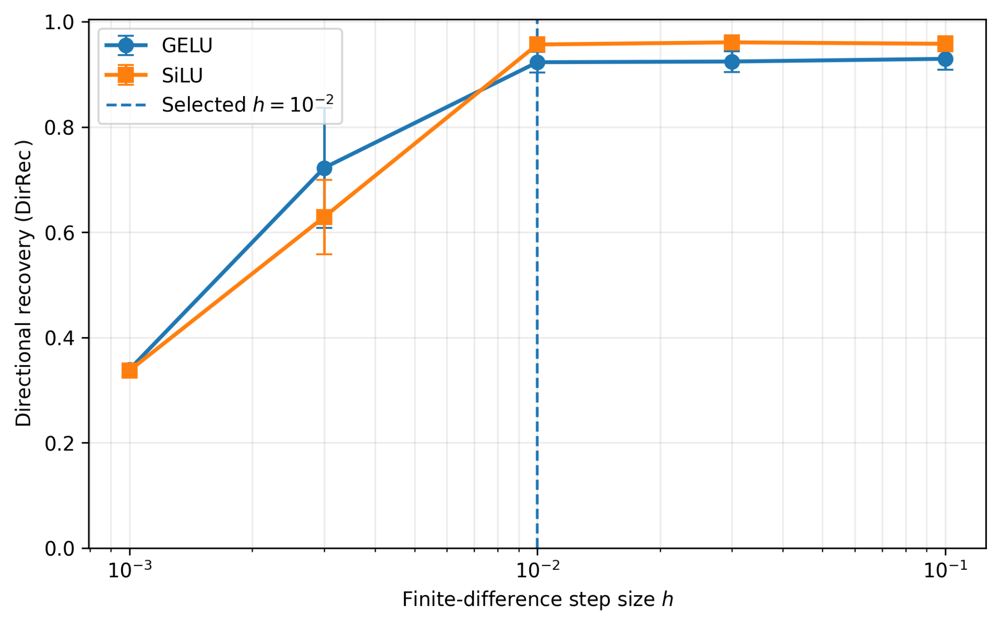
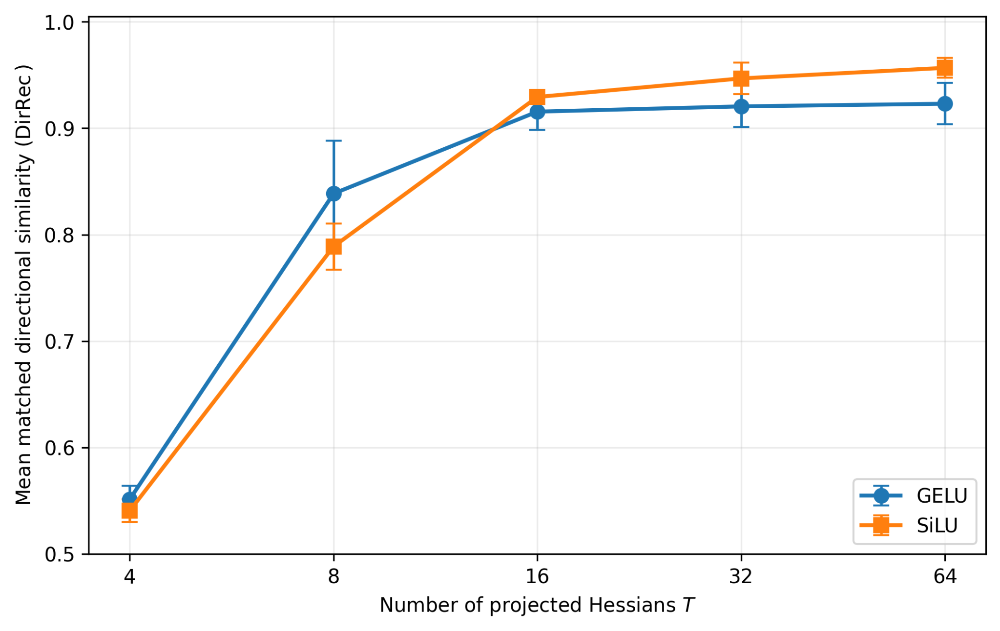
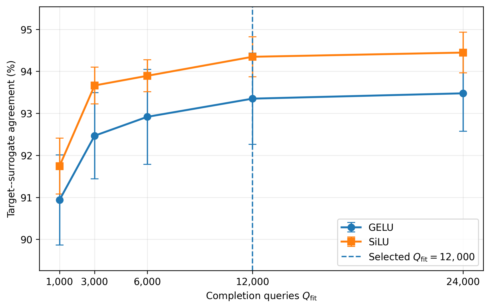
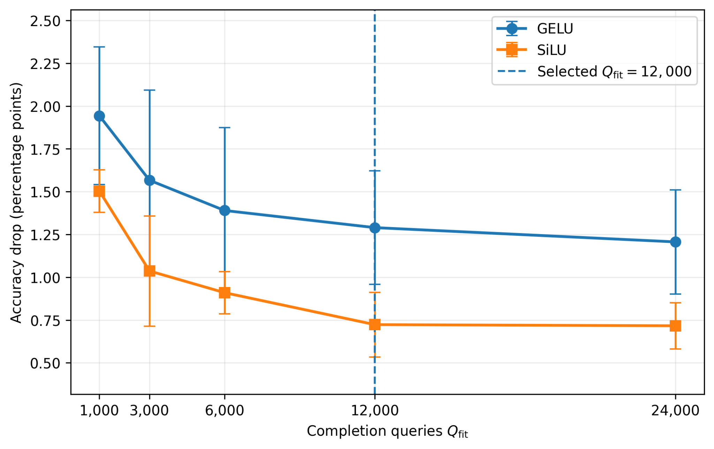

# Curvature Cryptanalysis of Smooth Transformer FFNs

[](https://arxiv.org/abs/2608.28843)
[](https://www.python.org/)
[](LICENSE)

End-to-end structural and functional model-extraction attack against smooth transformer feed-forward network (FFN) branches. Under chosen-input raw-output access—and without access to parameters, gradients, or internal activations—the attack uses centered finite differences to expose projected input Hessians that form different mixtures of the same hidden symmetric rank-one factors. Joint factorization recovers the FFN input-weight direction dictionary up to sign and permutation, while vector-output stencil reuse constructs 16 projected Hessians from only 8,193 black-box queries.

On independently trained CIFAR-10 vision transformers, the method achieves average absolute cosine alignment above 0.94, with 95.1% of GELU and 91.9% of SiLU directions exceeding 0.90 alignment. Keeping the recovered directions fixed and fitting only the remaining FFN parameters yields substitutes with more than 93% top-1 agreement, while test accuracy remains within 0.90 and 0.62 percentage points of the GELU and SiLU targets, respectively.

This repository provides the unified attack, completion, and evaluation pipeline for residual FFNs and trained CIFAR-10 transformers with GELU or SiLU activations.

## Oracle queries

For an FFN input dimension $d=64$, one shared probe stencil uses

$$
1+2d+4\binom{d}{2}=2d^2+1=8{,}193
$$

vector-valued oracle queries. All $T=16$ output projections are applied to the cached responses locally; they do not trigger new oracle calls.

| Component | Configuration | Vector queries |
|---|---:|---:|
| Structural curvature extraction | $d=64$, $P=1$, $T=16$ | 8,193 |
| Functional surrogate completion | $Q_{\mathrm{fit}}=12{,}000$ | 12,000 |
| **Total** |  | **20,193** |

The unshared baseline would spend $16\times8{,}193=131{,}088$ structural queries. Sharing the vector stencil therefore gives a **16× structural-query reduction** while retaining 16 projected Hessian mixtures.

## Results

Mean ± standard deviation across three independently trained CIFAR-10 victims:

| Activation | Direction recovery | Victim accuracy | Surrogate accuracy | Target–surrogate agreement |
|---|---:|---:|---:|---:|
| GELU | 0.9644 ± 0.0026 | 79.18 ± 0.36% | 78.28 ± 0.35% | 93.24 ± 0.45% |
| SiLU | 0.9476 ± 0.0022 | 78.18 ± 0.49% | 77.57 ± 0.41% | 94.89 ± 0.40% |

The exact aggregate values are also recorded in [`results/main_results.csv`](results/main_results.csv). The included figures report the finite-difference, projection-count, and completion-budget ablations.

### Finite-difference step



The selected finite-difference step is $h=10^{-2}$, where recovery has reached the stable high-recovery regime for both smooth activations.

### Number of projected Hessians



$T=16$ captures most of the recovery improvement. Under the optimized $P=1$ configuration, increasing $T$ changes offline computation but not the 8,193 structural oracle calls, provided the oracle returns the complete output vector.

### Completion-query budget





$Q_{\mathrm{fit}}=12{,}000$ is selected near the observed point of diminishing returns.

## Installation

```bash
git clone https://github.com/mhasan08/curvature-cryptanalysis.git
cd curvature-cryptanalysis
python -m venv .venv
source .venv/bin/activate
python -m pip install --upgrade pip
python -m pip install -e .
```

PyTorch installation can be platform-specific. If necessary, install the appropriate CPU or CUDA build from the [official PyTorch instructions](https://pytorch.org/get-started/locally/) before running `pip install -e .`.

## Quick start

### Fully self-contained controlled experiment

```bash
python -m curvature_cryptanalysis controlled \
  --out-dir runs/controlled_gelu \
  --activation gelu \
  --d 64 --m 128 \
  --T 16 --probe-locations 1 \
  --hessian-mode finite_diff --fd-eps 1e-2 \
  --dict-init random --dict-restarts 3 \
  --dict-steps 3000 --fit-steps 1500 \
  --fit-samples 12000 --seed 0
```

### Trained CIFAR-10 transformer: 20,193-query configuration

```bash
python -m curvature_cryptanalysis extract \
  --ckpt ./checkpoints/cifar10_gelu/best.pt \
  --out-dir ./runs/cifar10_gelu_T16_P1_Q12000_seed0 \
  --target-block 3 \
  --T 16 --probe-locations 1 \
  --projection-mode random \
  --hessian-mode finite_diff --fd-eps 1e-2 \
  --dict-init random --dict-restarts 3 \
  --dict-steps 3000 \
  --fit-steps 1500 --max-fit-samples 12000 \
  --seed 0
```

Equivalent convenience scripts are provided in [`scripts/`](scripts/). The trained workflow expects a compatible checkpoint; see [`docs/checkpoint_format.md`](docs/checkpoint_format.md). The original victim-training program is not included in this release, so the repository does not claim that the supplied attack file alone regenerates the trained checkpoints.

## Outputs

Each run writes:

| File | Contents |
|---|---|
| `result.json` | Configuration, query counts, recovery and fidelity metrics |
| `result.csv` | One-row tabular version of the result |
| `recovery_arrays.npz` | Hessians, probes, projections, recovered directions and optimization traces |
| `extracted_ffn.pt` | Completed controlled FFN, for the controlled workflow |
| `surrogate_replaced_block.pt` | Full surrogate state, for trained-model extraction |

The implementation performs an internal accounting check and aborts if the measured finite-difference query count differs from (P(2d^2+1)).

## Repository layout

```text
curvature-cryptanalysis/
├── src/curvature_cryptanalysis/   # Attack, completion and evaluation pipeline
├── scripts/                       # Reproduction and budget utilities
├── tests/                         # Lightweight accounting tests
├── figures/                       # Paper-quality ablation figures
├── results/                       # Reported aggregate results
└── docs/                          # Algorithm and checkpoint docs
```

## Method and threat model

The target oracle exposes the raw vector output of an FFN branch for chosen representation-space inputs. At each probe, the method caches the complete response at every diagonal and off-diagonal stencil point. Random or coordinate output projections then produce scalar Hessian mixtures offline. A shared rank-one dictionary is recovered by multi-restart Adam optimization, followed by optional natural-input completion with fixed recovered directions and trainable signed scales.

See [`docs/method.md`](docs/method.md) for the decomposition, stencil equations, and assumptions.

## Responsible use

This code is released for authorized research on model confidentiality, query-interface risk, and defenses against parameter extraction.

## License

Released under the [MIT License](LICENSE).
